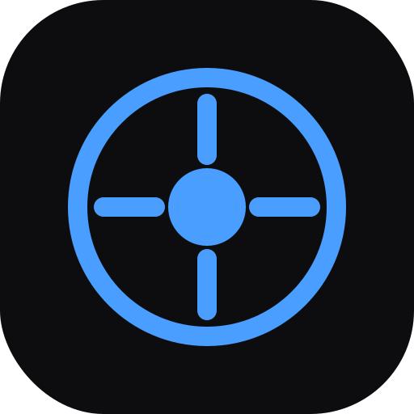

# OmniRecall

<div align="center">



**AI-Powered Document Assistant with Local RAG**

[](LICENSE)
[](https://tauri.app/)
[](https://www.rust-lang.org/)
[](https://www.typescriptlang.org/)

[Features](#features) • [Installation](#installation) • [Usage](#usage) • [Configuration](#configuration) • [Development](#development) • [Contributing](#contributing)

</div>

---

## Overview

OmniRecall is a high-performance, privacy-focused desktop application that brings RAG (Retrieval-Augmented Generation) directly to your fingertips. Unlike web-based chat interfaces, OmniRecall runs locally and can be summoned instantly via a global hotkey, enabling seamless AI-powered document queries without leaving your current workflow.

**Key Highlights:**
- Instant access via global hotkey (like Spotlight/Alfred)
- Multi-provider AI support (Gemini, OpenAI, Claude, Ollama)
- 100% local document storage - your data never leaves your device
- Bring your own API keys - pay only for what you use
- Lightweight and fast (~50MB RAM when idle)

## Features

### Multi-Provider AI Support
- **Google Gemini** - gemini-2.0-flash-exp, gemini-1.5-pro, and more
- **OpenAI** - GPT-4o, GPT-4-turbo, GPT-3.5-turbo
- **Anthropic Claude** - Claude 3.5 Sonnet, Claude 3 Opus
- **Ollama (Local)** - Llama 3.2, Mistral, CodeLlama, and any local model

### Two Operating Modes

**Spotlight Mode (Quick Access)**
- Instant overlay triggered by hotkey
- Clipboard-aware context injection
- Streaming responses
- Quick actions (Summarize, Explain, Translate)

**Dashboard Mode (Full Interface)**
- Three-panel layout (Spaces, Chat, Documents)
- Conversation history with search
- Document management with drag-and-drop
- Source citations with page references

### Knowledge Spaces
- Organize documents into separate spaces
- Each space has its own vector index
- Switch contexts instantly
- Cross-document queries within spaces

### Privacy First
- All vectors stored locally (LanceDB)
- API keys stored in OS credential manager
- No telemetry or data collection
- Optional fully local mode with Ollama

## Installation

### Download Installer

Download the latest release from the [Releases](https://github.com/Razee4315/omnirecall/releases) page:

- **Windows**: `OmniRecall_x.x.x_x64-setup.exe` (recommended) or `.msi`

### Build from Source

#### Prerequisites

- [Node.js](https://nodejs.org/) (v18 or higher)
- [Rust](https://rustup.rs/) (1.70 or higher)
- [Tauri CLI](https://tauri.app/v1/guides/getting-started/prerequisites)

#### Steps

```bash
# Clone the repository
git clone https://github.com/Razee4315/omnirecall.git
cd omnirecall

# Install dependencies
npm install

# Run in development mode
npm run tauri dev

# Build for production
npm run tauri build
```

The installer will be created in `src-tauri/target/release/bundle/`.

## Usage

### Getting Started

1. **Launch OmniRecall** from the desktop shortcut or Start Menu
2. **Open Settings** (Ctrl+, or click the gear icon)
3. **Add your API key**:
   - Get a free Gemini API key at [Google AI Studio](https://aistudio.google.com/apikey)
   - Or use OpenAI, Anthropic, or local Ollama
4. **Click "Test"** to verify the connection
5. **Start chatting!**

### Keyboard Shortcuts

| Shortcut | Action |
|----------|--------|
| `Alt + Space` | Toggle Spotlight Mode |
| `Ctrl + ,` | Open Settings |
| `Ctrl + N` | New Conversation |
| `Ctrl + B` | Toggle Sidebar |
| `Ctrl + D` | Toggle Document Drawer |
| `Enter` | Send Message |
| `Shift + Enter` | New Line |
| `Escape` | Close Spotlight |

### Adding Documents

1. Open Dashboard Mode (click expand icon in Spotlight)
2. Drag and drop files to the Document Drawer
3. Wait for indexing to complete
4. Ask questions about your documents!

**Supported Formats:**
- PDF (.pdf)
- Word (.docx)
- Text (.txt, .md)
- Code (.py, .js, .rs, .java, etc.)
- HTML (.html)

## Configuration

### API Keys

OmniRecall supports multiple AI providers. You only need to configure the ones you want to use.

| Provider | Get API Key | Free Tier |
|----------|-------------|-----------|
| Google Gemini | [AI Studio](https://aistudio.google.com/apikey) | Yes (generous) |
| OpenAI | [Platform](https://platform.openai.com/api-keys) | No |
| Anthropic | [Console](https://console.anthropic.com/) | No |
| Ollama | [Download](https://ollama.ai) | Yes (local) |

### Settings

Access settings via `Ctrl + ,` or the gear icon:

- **AI Providers**: Configure API keys and default models
- **Appearance**: Theme (Dark/Light), font size, accent color
- **Shortcuts**: Customize keyboard shortcuts
- **Advanced**: RAG parameters, context chunks, similarity threshold

## Project Structure

```
omnirecall/
├── src/                          # Frontend (Preact + TypeScript)
│   ├── components/
│   │   ├── icons/               # Custom SVG icons
│   │   ├── spotlight/           # Spotlight mode UI
│   │   ├── dashboard/           # Dashboard UI components
│   │   └── settings/            # Settings panel
│   ├── stores/                  # State management (Preact Signals)
│   └── styles/                  # Tailwind CSS + design system
├── src-tauri/                   # Backend (Rust)
│   └── src/
│       ├── commands/            # Tauri IPC commands
│       └── services/            # AI client, embedding, document pipeline
├── package.json
├── tailwind.config.js
└── vite.config.ts
```

## Technology Stack

- **Framework**: [Tauri v2](https://tauri.app/) - Lightweight native app framework
- **Frontend**: [Preact](https://preactjs.com/) + [TypeScript](https://www.typescriptlang.org/)
- **Styling**: [Tailwind CSS](https://tailwindcss.com/)
- **Backend**: [Rust](https://www.rust-lang.org/)
- **Vector DB**: [LanceDB](https://lancedb.com/) (embedded)
- **State**: [Preact Signals](https://preactjs.com/guide/v10/signals/)

## Development

### Prerequisites

```bash
# Install Rust
curl --proto '=https' --tlsv1.2 -sSf https://sh.rustup.rs | sh

# Install Node.js dependencies
npm install

# Install Tauri CLI
npm install -g @tauri-apps/cli
```

### Development Commands

```bash
# Start development server with hot reload
npm run tauri dev

# Build for production
npm run tauri build

# Run frontend only (for UI development)
npm run dev

# Type check
npm run build
```

### Adding a New AI Provider

1. Add provider configuration in `src/stores/appStore.ts`
2. Implement the provider client in `src-tauri/src/services/ai_client.rs`
3. Add UI components in `src/components/settings/Settings.tsx`

## Roadmap

- [ ] macOS and Linux support
- [ ] Image embedding and search
- [ ] Voice input
- [ ] Browser extension for web clipping
- [ ] Plugin/extension system
- [ ] Cloud sync (optional, user's own storage)
- [ ] Mobile companion app

## Contributing

Contributions are welcome! Please read our [Contributing Guide](CONTRIBUTING.md) for details.

1. Fork the repository
2. Create your feature branch (`git checkout -b feature/amazing-feature`)
3. Commit your changes (`git commit -m 'Add amazing feature'`)
4. Push to the branch (`git push origin feature/amazing-feature`)
5. Open a Pull Request

## License

This project is licensed under the MIT License - see the [LICENSE](LICENSE) file for details.

## Author

**Saqlain Razee**

- GitHub: [@Razee4315](https://github.com/Razee4315)
- LinkedIn: [saqlainrazee](https://linkedin.com/in/saqlainrazee)
- Email: saqlainrazee@gmail.com

## Acknowledgments

- [Tauri](https://tauri.app/) - For the amazing framework
- [Google AI](https://ai.google.dev/) - For Gemini API
- [LanceDB](https://lancedb.com/) - For the embedded vector database

---

<div align="center">

**If you find OmniRecall useful, please consider giving it a star!**

[](https://github.com/Razee4315/omnirecall)

</div>
